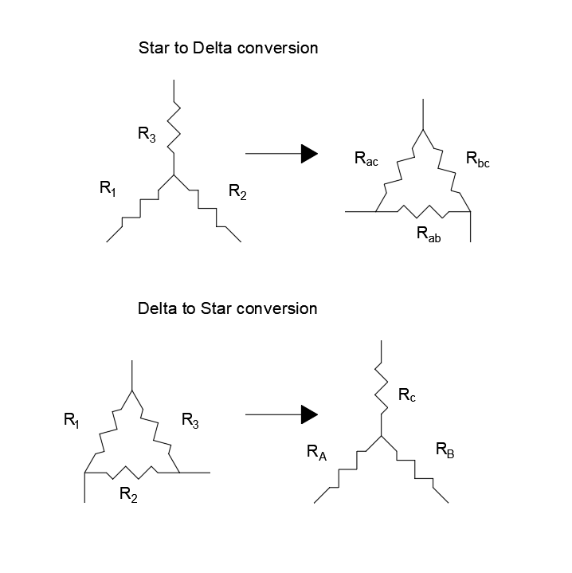

<h2 align="center">Δ ↔ λ converter</h2>
 
Ever had to manually convert a star connection into a delta or vice-versa?
 
If you had, you'll know that working with different resistors is a pain in the <i><s>ass</s></i>.
 
Well, I got bored of calculating it by hand and so I made this script to make it faster
 
 
<h3>Binding</h3>

 
 
<h3>Instrucions</h3>
- Choose an operation [Star to Delta or Delta to Star] 
- Insert the values of the resistors [exclude the omega and use periods instead of commas] 
- Double check the bindings 
- Voilà, you have the result ;)